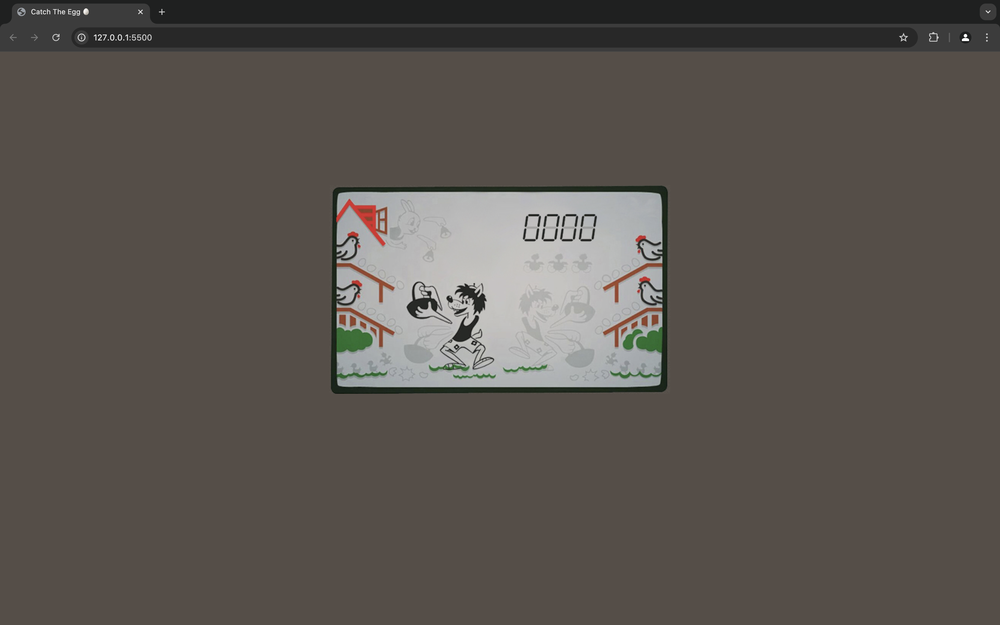

# Catch The Egg Game

Welcome to the "Catch The Egg" game! This repository contains a simple browser-based game where players control a basket to catch falling eggs. The game includes a graphical interface, a scoring system, and keyboard controls.

## Overview

- **HTML**: The structure of the game interface.
- **CSS**: Styling for the game layout and visual elements.
- **JavaScript**: Game logic, controls, and interaction.

## Getting Started

To get started with the game, follow these instructions:

### Prerequisites

Ensure you have a modern web browser installed. The game is compatible with most up-to-date browsers.

### Installation

1. **Clone the Repository**

   ```bash
   git clone https://github.com/yourusername/catch-the-egg.git
   cd catch-the-egg
   ```

2. **Directory Structure**

   The repository contains the following files and directories:

   - `index.html`: The main HTML file for the game.
   - `css/styles.css`: The stylesheet for game styling.
   - `js/`: Directory containing JavaScript files for game functionality.
     - `scripts1.js`: Utility functions for array and element manipulation.
     - `scripts2.js`: Keyboard input management.
     - `scripts3.js`: Game logic, including grid and egg behavior.
     - `scripts4.js`: DOM manipulation and updates.
     - `app.js`: Initializes the game manager.
   - `img/`: Directory for images used in the game.

### Running the Game

To run the game:

1. Open the `index.html` file in your web browser. You can simply double-click the file or use a local server for better performance.

   ```bash
   # Using a simple HTTP server (Python)
   python -m http.server
   ```

2. Navigate to `http://localhost:8000` in your browser if you used a local server.

## Game Controls

- **Arrow Keys**: Move the basket (Up, Down, Left, Right).
- **Q**: Move basket to top-left.
- **A**: Move basket to bottom-left.
- **E**: Move basket to top-right.
- **D**: Move basket to bottom-right.
- **R**: Restart the game.

## File Descriptions

### `index.html`

Defines the structure of the game, including the game area, score display, and control buttons.

### `css/styles.css`

Styles the game interface, including the basket, wolf, eggs, and score display. It also includes responsive design adjustments for different screen sizes.

### `js/scripts1.js`

Provides utility functions for array manipulation and element visibility.

### `js/scripts2.js`

Handles keyboard input and maps keys to game actions.

### `js/scripts3.js`

Contains game logic for the grid, eggs, and baskets, including movement and scoring.

### `js/scripts4.js`

Manages DOM updates for game elements like egg positions and score display.

### `js/app.js`

Initializes the game manager and sets up the game environment.

## Contributing

If you'd like to contribute to the project, please follow these steps:

1. Fork the repository.
2. Create a new branch for your changes.
3. Commit your changes with clear and concise messages.
4. Open a pull request with a description of your changes.

## License

This project is licensed under the MIT License. See the [LICENSE](LICENSE) file for more details.
